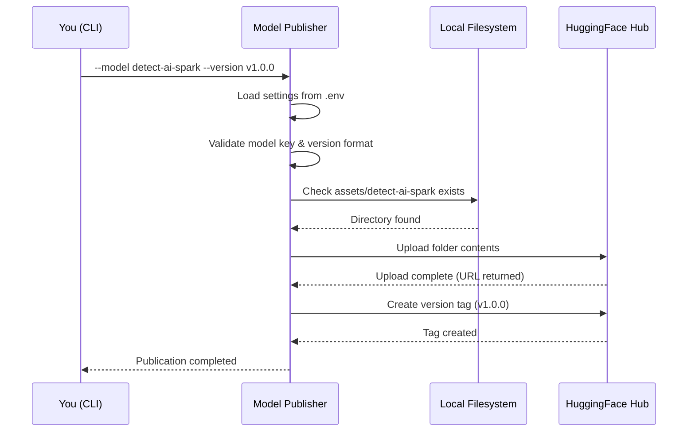

# Quick Start

This guide will help you publish your first DetectAI model to HuggingFace Hub in under 5 minutes.

## Prerequisites

- **Python 3.11+** (check with `python --version`)
- **Poetry** (install from [python-poetry.org](https://python-poetry.org))
- **A HuggingFace account** with a write token ([get one here](https://huggingface.co/settings/tokens))

## Step 1: Install Dependencies

```bash
# From the project root
poetry -C tools/model-publisher install

# Or using Make
make -C tools/model-publisher install
```

## Step 2: Configure Credentials

```bash
# Navigate to the tool directory
cd tools/model-publisher

# Create your .env file from the template
cp .env.example .env
```

Edit `.env` and fill in your credentials:

```bash
HF_TOKEN=hf_xxxxxxxxxxxxxxxxxxxxxxxx    # Your HuggingFace write token
HF_USERNAME=your_username               # Your HuggingFace username
```

> **Important:** Never commit your `.env` file or share your `HF_TOKEN`. The token is validated on startup and must be at least 8 characters.

## Step 3: Validate with Dry-Run (Recommended)

Before publishing for real, validate everything locally without touching the network:

```bash
# From the project root
poetry -C tools/model-publisher run python main.py \
  --model detect-ai-spark \
  --version v1.0.0 \
  --dry-run

# Or using Make
make -C tools/model-publisher dry-run model=detect-ai-spark v=v1.0.0
```

Expected output:

```
dry-runPublishing detect-ai-spark @ v1.0.0 ...
  hf_user: your_username  token: hf_****xxxx
  mode: DRY-RUN (no upload/tag)
Dry-run validated: /path/to/assets/detect-ai-spark -> your_username/detect-ai-spark (v1.0.0)
Dry-run completed successfully.
```

## Step 4: Publish for Real

```bash
# Publish detect-ai-spark
poetry -C tools/model-publisher run python main.py \
  --model detect-ai-spark \
  --version v1.0.0

# Or using Make shortcuts
make -C tools/model-publisher upload-spark v=v1.0.0
make -C tools/model-publisher upload-flare v=v1.0.0
```

Expected output:

```
Publishing detect-ai-spark @ v1.0.0 ...
  hf_user: your_username  token: hf_****xxxx
Uploaded to https://huggingface.co/your_username/detect-ai-spark/tree/v1.0.0
Tagged v1.0.0
Publication completed successfully.
```

## What Just Happened?



1. **Loaded settings** - Read `HF_TOKEN` and `HF_USERNAME` from your `.env` file
2. **Validated inputs** - Checked that `detect-ai-spark` matches the model key pattern and `v1.0.0` is a valid version
3. **Resolved artifacts** - Found the `assets/detect-ai-spark` directory on your filesystem
4. **Uploaded to HuggingFace** - Pushed all files in the assets directory to `your_username/detect-ai-spark`
5. **Created version tag** - Tagged the upload as `v1.0.0` so it's easy to find later

## Verify Your Publish

Visit your model on HuggingFace:

```
https://huggingface.co/<your_username>/<model>/tree/<version>
```

For example:
```
https://huggingface.co/your_username/detect-ai-spark/tree/v1.0.0
```

## Next Steps

- [Configuration](configuration.md) - Customize settings for your environment
- [CLI Reference](../components/cli.md) - All command-line options
- [Publishing Flow](../concepts/publishing-flow.md) - Understand the full lifecycle
- [Architecture](../concepts/architecture.md) - How the tool is built

## Troubleshooting

### "HF_TOKEN must be non-empty"

Your `.env` file is missing or `HF_TOKEN` is not set. Make sure you've created `.env` from `.env.example` and filled in your token.

### "HF_TOKEN looks too short"

Your token is fewer than 8 characters. Double-check you copied the full token from HuggingFace settings.

### "HF_TOKEN must not be a placeholder"

The token value looks like a placeholder (e.g., `test`, `change-me`, `not-configured`). Use your real HuggingFace write token.

### "Assets not found at ..."

The `assets/<model>` directory doesn't exist. Make sure you're running the command from the project root, or use `--assets-dir` to specify a custom path.

### "Tag already exists"

You've already published this version. Bump the version number (e.g., `v1.0.1`) or delete the existing tag on HuggingFace.

### "Configuration error"

Check that your `.env` file is in the `tools/model-publisher` directory and contains valid values. See [Configuration](configuration.md) for all options.

## Stopping / Cleanup

This tool runs once and exits. There's no process to stop. To clean up generated files:

```bash
make -C tools/model-publisher clean
```
